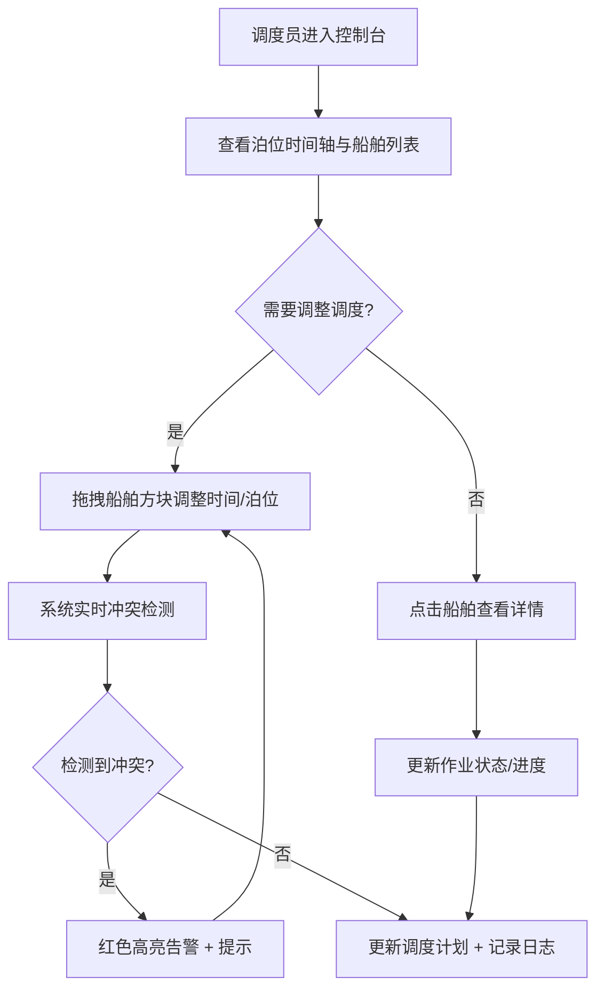

## 1. 产品概述

港口泊位调度前端应用是面向港口运营调度人员的高密度运营控制台，用于实时监控和管理船舶靠泊计划、泊位占用、装卸作业状态。系统通过可视化时间轴和拖拽交互，实现高效的泊位资源调度、冲突预警和作业跟踪。

- 目标用户：港口调度员、运营主管、码头作业管理人员
- 核心价值：提升港口泊位利用率、减少船舶等待时间、降低调度冲突风险

## 2. 核心功能

### 2.1 用户角色
| 角色 | 注册方式 | 核心权限 |
|------|----------|----------|
| 调度员 | 系统账号 | 查看调度全景、拖拽调整泊位计划、更新作业状态、查看日志 |
| 运营主管 | 系统账号 | 全部调度员权限 + 导出报表、配置优先级规则 |

### 2.2 功能模块
1. **运营控制台（首页）**：泊位时间轴总览、船舶到港计划列表、实时指标卡、潮汐信息
2. **泊位时间轴调度**：甘特图式泊位占用展示、拖拽调整靠泊时间、冲突检测高亮
3. **船舶详情侧栏**：船舶基础信息、吃水深度、货物类型、作业进度、历史记录
4. **作业状态管理**：靠泊中/装卸中/离泊中状态切换、作业百分比更新
5. **调度日志**：操作记录、变更历史、冲突告警、状态流转记录

### 2.3 页面详情
| 页面名称 | 模块名称 | 功能描述 |
|----------|----------|----------|
| 运营控制台 | 顶部指标卡 | 展示在港船舶数、待泊船舶数、泊位利用率、今日作业量 |
| 运营控制台 | 泊位时间轴 | 多泊位纵向排列的甘特图，横轴为时间，显示各船舶占用时段 |
| 运营控制台 | 船舶计划列表 | 待泊/在港/离泊船舶的高密度表格，含优先级、ETA/ETD等 |
| 运营控制台 | 潮汐窗口条 | 可视化显示高低潮时间窗口，关联吃水限制 |
| 船舶详情侧栏 | 船舶信息卡片 | 船名、呼号、IMO、船长、船宽、吃水深度、货物类型 |
| 船舶详情侧栏 | 作业进度面板 | 装卸类型、已完成百分比、预计完成时间、作业班组 |
| 船舶详情侧栏 | 状态操作区 | 状态切换按钮、优先级调整、备注输入 |
| 调度日志面板 | 日志列表 | 时间倒序的操作记录、变更前后对比、操作人信息 |
| 调度日志面板 | 冲突告警 | 红色高亮显示时间冲突、吃水超限、优先级插队等告警 |

## 3. 核心流程

调度员登录系统后，首页展示当前所有泊位占用情况和船舶到港计划。调度员可通过拖拽时间轴上的船舶方块调整靠泊/离泊时间，系统实时检测冲突并高亮告警。点击任意船舶可打开详情侧栏查看完整信息并更新作业状态。所有操作自动记入调度日志。

## 4. 用户界面设计

### 4.1 设计风格
- **主色调**：深海蓝 `#0a1628` 作为背景，工业橙 `#ff6b35` 作为强调色，港口青 `#00d4aa` 作为正常状态色，警示红 `#ff4757` 作为告警色
- **字体**：等宽字体 JetBrains Mono 用于数据展示（时间、编号），Inter 用于说明文本
- **视觉风格**：工业控制台风（Dark Industrial Console），高密度信息布局，发光边框指示活动状态，网格背景增强精密感
- **按钮风格**：扁平方形，2px圆角，hover时发光边框，active时下压
- **图标风格**：线性图标，统一2px描边

### 4.2 页面设计概述
| 页面名称 | 模块名称 | UI元素 |
|----------|----------|--------|
| 运营控制台 | 顶部指标卡 | 深色背景卡片，数字大号显示，趋势小箭头，边框微发光 |
| 运营控制台 | 泊位时间轴 | 网格背景，船舶方块可拖拽，冲突时红色闪烁边框，当前时间竖线 |
| 运营控制台 | 船舶计划表格 | 斑马行，高优先级行左侧橙色条，状态色标签 |
| 运营控制台 | 潮汐窗口条 | 正弦曲线渐变填充，高低潮标注，当前位置指示 |
| 船舶详情侧栏 | 信息卡片 | 分组折叠面板，关键数据大号展示，辅助信息小字 |
| 调度日志面板 | 日志条目 | 时间戳 + 操作人 + 变更摘要，冲突条目红色背景 |

### 4.3 响应式
- Desktop-first，最小支持 1440px 宽度
- 1920px 及以上展示完整信息密度
- 侧栏可折叠，时间轴可水平滚动

### 4.4 动效设计
- 页面加载：指标卡数字从0滚动到目标值（countUp效果）
- 拖拽：船舶方块半透明跟随鼠标，释放时弹性过渡
- 冲突检测：边框红色脉冲闪烁（`@keyframes pulse-red`）
- 状态切换：进度条平滑过渡，状态标签颜色渐变
