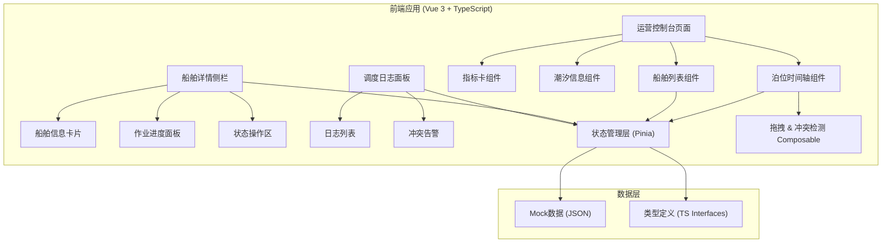

## 1. 架构设计



## 2. 技术描述

- **前端框架**：Vue 3 + `<script setup>` + TypeScript
- **构建工具**：Vite 5
- **样式方案**：Tailwind CSS 3 + CSS Variables（主题色）
- **状态管理**：Pinia
- **路由**：Vue Router 4
- **拖拽实现**：原生 HTML5 Drag & Drop API + 自定义 composable
- **日期时间处理**：date-fns
- **图标**：lucide-vue-next
- **后端**：无后端，使用 Mock 数据模拟
- **初始化方式**：`vue-ts` 模板（Vite + Vue + TS + Tailwind）

## 3. 路由定义

| 路由 | 用途 |
|------|------|
| `/` | 运营控制台（首页）- 泊位时间轴、船舶列表、指标总览 |
| `/logs` | 调度日志页面 - 完整操作记录与冲突告警 |

## 4. 数据模型

### 4.1 类型定义

```typescript
// 船舶优先级
export type ShipPriority = 'critical' | 'high' | 'normal' | 'low';

// 作业状态
export type OperationStatus = 'anchored' | 'approaching' | 'berthing' | 'loading' | 'unloading' | 'departing' | 'departed';

// 货物类型
export type CargoType = 'container' | 'bulk' | 'liquid' | 'general' | 'ro-ro';

// 船舶信息
export interface Ship {
  id: string;
  name: string;
  imo: string;
  callSign: string;
  length: number;       // 米
  width: number;        // 米
  draft: number;        // 吃水深度（米）
  maxDraft: number;     // 最大吃水
  cargoType: CargoType;
  cargoWeight: number;  // 吨
  priority: ShipPriority;
}

// 泊位
export interface Berth {
  id: string;
  name: string;
  length: number;       // 泊位长度（米）
  maxDraft: number;     // 最大吃水（米）
  allowedCargo: CargoType[];
  position: number;     // 排序位置
}

// 泊位调度计划
export interface BerthSchedule {
  id: string;
  shipId: string;
  berthId: string;
  eta: Date;            // 预计到港时间
  etd: Date;            // 预计离泊时间
  actualBerthing?: Date;
  actualDeparture?: Date;
  status: OperationStatus;
  operationProgress: number; // 0-100
  operationTeam?: string;
  remarks?: string;
}

// 潮汐记录
export interface TideRecord {
  time: Date;
  height: number;       // 米
  type: 'high' | 'low' | 'rising' | 'falling';
}

// 调度日志
export type LogType = 'create' | 'update' | 'delete' | 'status_change' | 'conflict' | 'warning';

export interface ScheduleLog {
  id: string;
  timestamp: Date;
  type: LogType;
  operator: string;
  scheduleId?: string;
  shipId?: string;
  description: string;
  before?: Record<string, unknown>;
  after?: Record<string, unknown>;
}

// 调度冲突
export interface ScheduleConflict {
  id: string;
  type: 'time_overlap' | 'draft_exceed' | 'length_exceed' | 'cargo_mismatch' | 'tide_window';
  severity: 'error' | 'warning';
  scheduleId: string;
  message: string;
}
```

### 4.2 状态管理 (Pinia Store)

```typescript
// useScheduleStore
export interface ScheduleState {
  ships: Ship[];
  berths: Berth[];
  schedules: BerthSchedule[];
  tides: TideRecord[];
  logs: ScheduleLog[];
  selectedScheduleId: string | null;
  conflicts: ScheduleConflict[];
}
```

### 4.3 核心 Composables

- `useDragSchedule`：处理船舶方块的拖拽逻辑（时间轴上水平移动改时间、纵向移动改泊位）
- `useConflictDetection`：实时检测调度冲突（时间重叠、吃水超限、泊位长度、货物匹配、潮汐窗口）
- `useScheduleLogger`：记录所有操作变更到日志系统

## 5. 组件结构

```
src/
├── components/
│   ├── console/
│   │   ├── StatsCards.vue          # 顶部指标卡
│   │   ├── BerthTimeline.vue       # 泊位时间轴（核心甘特图）
│   │   ├── TimelineShipBlock.vue   # 时间轴上的可拖拽船舶方块
│   │   ├── ShipListTable.vue       # 船舶计划列表
│   │   └── TideIndicator.vue       # 潮汐窗口指示条
│   ├── sidebar/
│   │   ├── ShipDetailSidebar.vue   # 船舶详情侧栏容器
│   │   ├── ShipInfoCard.vue        # 船舶基础信息
│   │   ├── OperationProgress.vue   # 作业进度面板
│   │   └── StatusActions.vue       # 状态操作按钮组
│   ├── logs/
│   │   ├── LogPanel.vue            # 调度日志面板
│   │   └── ConflictAlert.vue       # 冲突告警条目
│   └── common/
│       ├── PriorityBadge.vue       # 优先级标签
│       ├── StatusBadge.vue         # 状态标签
│       └── CargoTypeIcon.vue       # 货物类型图标
├── composables/
│   ├── useDragSchedule.ts
│   ├── useConflictDetection.ts
│   └── useScheduleLogger.ts
├── stores/
│   └── schedule.ts
├── types/
│   └── index.ts
├── data/
│   └── mock.ts
├── pages/
│   ├── ConsolePage.vue
│   └── LogsPage.vue
├── router/
│   └── index.ts
├── App.vue
└── main.ts
```
