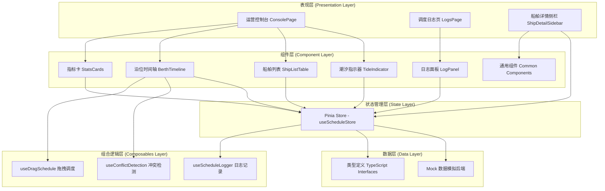
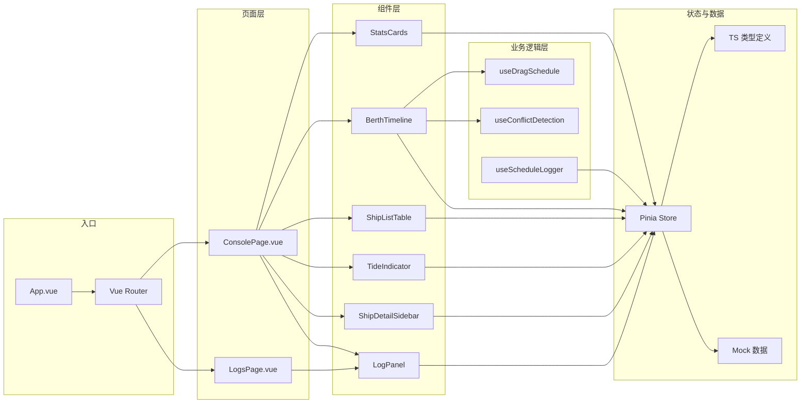
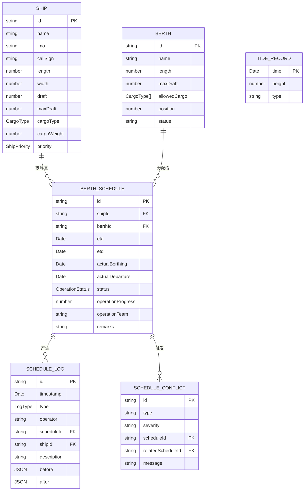
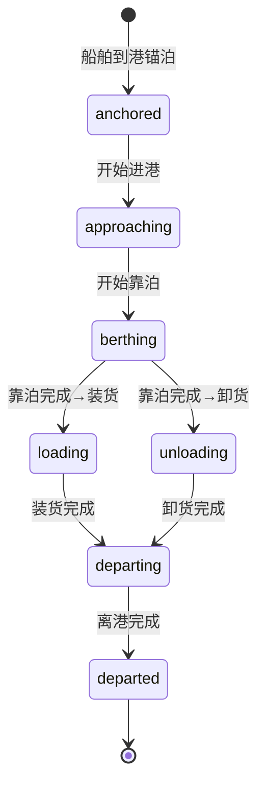
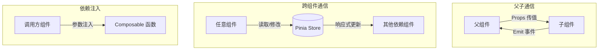
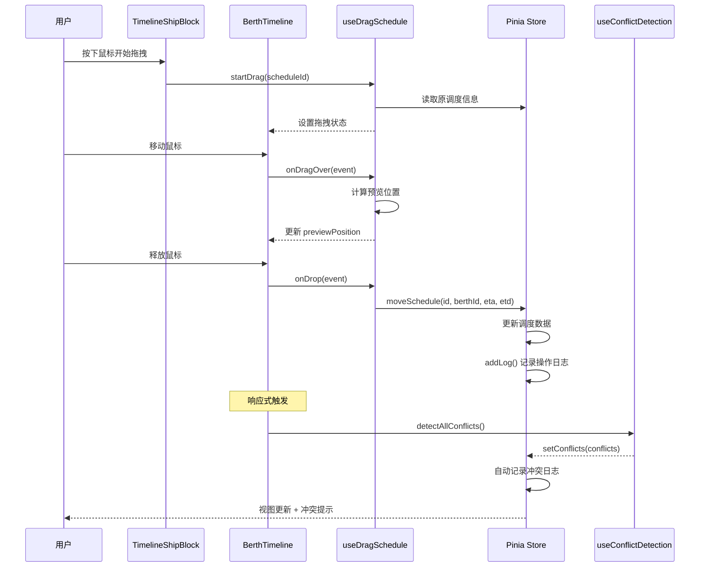
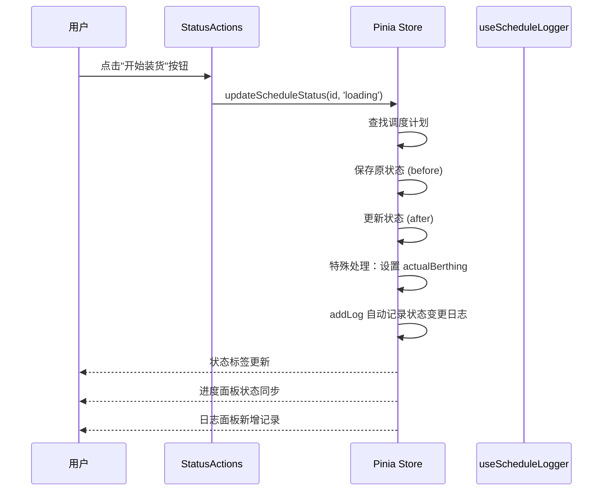
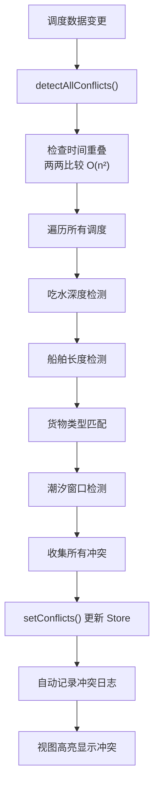

# PORTOS 港口泊位调度系统 — 架构总结与设计模式讲解

## 目录

- [一、项目概述](#一项目概述)
- [二、整体架构图](#二整体架构图)
- [三、技术栈详解](#三技术栈详解)
- [四、分层架构设计](#四分层架构设计)
- [五、核心设计模式](#五核心设计模式)
- [六、数据模型设计](#六数据模型设计)
- [七、组件架构](#七组件架构)
- [八、关键交互流程](#八关键交互流程)

---

## 一、项目概述

**PORTOS**（Berth Operations Control System）是面向港口运营调度人员的高密度运营控制台，用于实时监控和管理船舶靠泊计划、泊位占用、装卸作业状态。系统通过可视化时间轴和拖拽交互，实现高效的泊位资源调度、冲突预警和作业跟踪。

### 核心价值

- 提升港口泊位利用率
- 减少船舶等待时间
- 降低调度冲突风险

### 目标用户

- 港口调度员
- 运营主管
- 码头作业管理人员

---

## 二、整体架构图

### 2.1 系统总架构图



### 2.2 模块依赖关系图



---

## 三、技术栈详解

| 分类 | 技术 | 版本 | 用途 |
|------|------|------|------|
| 前端框架 | Vue 3 | ^3.4.15 | 响应式 UI 框架，使用 Composition API |
| 语言 | TypeScript | ~5.3.3 | 类型安全的 JavaScript 超集 |
| 构建工具 | Vite | ^5.0.12 | 下一代前端构建工具 |
| 状态管理 | Pinia | ^2.1.7 | Vue 官方推荐的状态管理库 |
| 路由 | Vue Router | ^4.2.5 | 官方路由管理器 |
| CSS 框架 | Tailwind CSS | ^3.4.1 | 实用优先的 CSS 框架 |
| 日期处理 | date-fns | ^3.6.0 | 现代 JavaScript 日期工具库 |
| 图标库 | lucide-vue-next | ^0.511.0 | 精美开源图标库 |
| 样式工具 | clsx + tailwind-merge | ^2.1.1 / ^3.3.0 | 条件类名与 Tailwind 合并 |
| 代码规范 | ESLint | ^8.56.0 | 代码质量与风格检查 |

### 技术选型考量

1. **Vue 3 + `<script setup>`**：提供更简洁的组件语法和更好的 TypeScript 类型推导
2. **Pinia 替代 Vuex**：更轻量、更好的 TypeScript 支持、Devtools 集成
3. **Tailwind CSS**：快速构建工业控制台风格 UI，原子化 CSS 减少样式文件
4. **date-fns**：比 Moment.js 更轻量，函数式 API 便于 Tree Shaking
5. **原生 Drag & Drop**：避免引入第三方拖拽库，减少包体积

---

## 四、分层架构设计

PORTOS 采用**四层架构**设计，各层职责清晰，依赖方向单向（从上层到下层）。

### 4.1 分层总览

| 层级 | 职责 | 核心模块 |
|------|------|----------|
| **页面层 (Pages)** | 页面级组合、布局编排、路由入口 | ConsolePage、LogsPage |
| **组件层 (Components)** | 可复用 UI 组件、交互封装 | BerthTimeline、ShipDetailSidebar 等 |
| **组合逻辑层 (Composables)** | 可复用业务逻辑、状态行为封装 | useDragSchedule、useConflictDetection 等 |
| **状态数据层 (Store + Data)** | 全局状态管理、数据持久化、类型定义 | useScheduleStore、types、mock |

### 4.2 单向数据流原则

```
用户交互 → 组件事件 → Composables 处理 → Store 更新 → 响应式刷新视图
```

### 4.3 各层详细说明

#### 页面层 (Pages)

页面层是路由的直接入口，负责：
- 页面级布局编排
- 组件的组合与装配
- 页面级生命周期管理

代表文件：
- [ConsolePage.vue](file:///d:/project/hjj-3/src/pages/ConsolePage.vue) — 运营控制台首页
- [LogsPage.vue](file:///d:/project/hjj-3/src/pages/LogsPage.vue) — 调度日志页

#### 组件层 (Components)

组件层按功能域划分子目录：

```
components/
├── common/         # 通用基础组件（跨页面复用）
├── console/        # 控制台页面专属组件
├── sidebar/        # 侧边栏相关组件
└── logs/           # 日志相关组件
```

#### 组合逻辑层 (Composables)

这是 Vue 3 Composition API 的核心应用层，封装可复用的业务逻辑：

| Composable | 职责 | 关注点 |
|------------|------|--------|
| useDragSchedule | 拖拽调度逻辑 | 拖拽状态、预览位置、坐标转换 |
| useConflictDetection | 冲突检测算法 | 时间重叠、吃水限制、长度限制等 |
| useScheduleLogger | 操作日志封装 | 日志创建、过滤、查询 |

#### 状态数据层

- **Pinia Store**：全局单一状态源，提供读写 API
- **TypeScript 类型**：定义所有数据实体的契约
- **Mock 数据**：模拟后端数据，便于前端独立开发

---

## 五、核心设计模式

### 5.1 Store 模式 (单一状态源)

**模式说明**：使用 Pinia 创建全局单一状态源，所有组件共享同一份调度数据。

**实现位置**：[schedule.ts](file:///d:/project/hjj-3/src/stores/schedule.ts)

**核心结构**：

```typescript
// 状态 (State)
const ships = ref<Ship[]>(mockShips);
const berths = ref<Berth[]>(mockBerths);
const schedules = ref<BerthSchedule[]>(mockSchedules);
const conflicts = ref<ScheduleConflict[]>([]);

// 计算属性 (Getters)
const sortedBerths = computed(() => ...);
const selectedSchedule = computed(() => ...);
const shipsInPort = computed(() => ...);
const berthUtilization = computed(() => ...);

// 动作 (Actions)
function updateSchedule(id: string, updates: Partial<BerthSchedule>) { ... }
function moveSchedule(id: string, berthId: string, eta: Date, etd: Date) { ... }
function setConflicts(newConflicts: ScheduleConflict[]) { ... }
```

**设计优势**：
- ✅ 单一数据源，避免数据不一致
- ✅ 集中式状态变更，便于调试和日志记录
- ✅ 计算属性缓存派生数据，提升性能
- ✅ Devtools 时间旅行调试支持

### 5.2 Composable 模式 (组合式函数)

**模式说明**：将相关的状态和逻辑封装成可复用的函数，遵循关注点分离原则。

**典型实现 — useDragSchedule**：

```typescript
// 输入：依赖注入的函数和 ref
export function useDragSchedule(
  getTimeFromX: (x: number) => Date,    // 坐标→时间转换
  getBerthFromY: (y: number) => string | null, // 坐标→泊位转换
  getDuration: () => number,             // 获取调度时长
  timelineRef: { value: HTMLElement | null }, // 时间轴 DOM 引用
) {
  // 内部状态
  const dragState = ref<DragState>({ ... });
  const previewPosition = ref(...)

  // 内部方法
  function startDrag(e: DragEvent, scheduleId: string) { ... }
  function onDragOver(e: DragEvent) { ... }
  function onDrop(e: DragEvent) { ... }

  // 暴露公共 API
  return { dragState, previewPosition, startDrag, onDragOver, onDrop };
}
```

**设计优势**：
- ✅ 逻辑复用：拖拽逻辑可在多个组件中使用
- ✅ 关注点分离：拖拽逻辑与 UI 渲染解耦
- ✅ 灵活性：通过参数注入适配不同场景
- ✅ 可测试性：纯函数逻辑易于单元测试

### 5.3 策略模式 (Strategy Pattern)

**模式说明**：冲突检测系统将不同类型的冲突检测封装为独立的检测策略，可灵活组合。

**实现位置**：[useConflictDetection.ts](file:///d:/project/hjj-3/src/composables/useConflictDetection.ts)

**策略族**：

| 策略函数 | 检测类型 | 严重级别 |
|----------|----------|----------|
| `checkTimeOverlap` | 时间重叠冲突 | error |
| `checkDraftLimit` | 吃水深度超限 | error / warning |
| `checkLengthLimit` | 船舶长度超限 | error |
| `checkCargoMatch` | 货物类型不匹配 | error |
| `checkTideWindow` | 潮汐窗口告警 | warning |

**统一入口 — detectAllConflicts**：

```typescript
function detectAllConflicts(
  schedules: BerthSchedule[],
  ships: Ship[],
  berths: Berth[],
  tides: TideRecord[],
): ScheduleConflict[] {
  const conflicts: ScheduleConflict[] = [];

  // 两两比较时间重叠
  for (let i = 0; i < schedules.length; i++) {
    for (let j = i + 1; j < schedules.length; j++) {
      const timeConflict = checkTimeOverlap(schedules[i], schedules[j]);
      if (timeConflict) conflicts.push(timeConflict);
    }
  }

  // 逐个检查其他约束
  schedules.forEach((schedule) => {
    const ship = ships.find(...);
    const berth = berths.find(...);
    if (ship && berth) {
      conflicts.push(checkDraftLimit(schedule, ship, berth));
      conflicts.push(checkLengthLimit(schedule, ship, berth));
      conflicts.push(checkCargoMatch(schedule, ship, berth));
      conflicts.push(checkTideWindow(schedule, ship, berth, tides));
    }
  });

  return conflicts.filter(Boolean);
}
```

**设计优势**：
- ✅ 开闭原则：新增冲突类型只需添加新函数
- ✅ 单一职责：每个策略只负责一类检测
- ✅ 可独立测试：各策略函数可单独单元测试
- ✅ 灵活组合：可根据场景启用部分检测策略

### 5.4 观察者模式 (Observer Pattern)

**模式说明**：利用 Vue 的响应式系统，当状态变更时自动通知依赖的视图和计算属性更新。

**实现方式**：Vue 3 的 `ref` / `computed` / `watch` 底层基于 Proxy 实现的响应式系统。

**典型应用**：

```typescript
// 在 BerthTimeline 中监听调度变更，自动重新检测冲突
watch(
  () => store.schedules.map((s) => [s.berthId, s.eta, s.etd]),
  () => {
    detectAllConflicts(store.schedules, store.ships, store.berths, store.tides);
  },
  { deep: true },
);
```

**设计优势**：
- ✅ 声明式：只需声明依赖关系，无需手动管理更新
- ✅ 细粒度更新：精确追踪哪些数据被使用，只更新必要的部分
- ✅ 自动触发：数据变更时视图和逻辑自动响应

### 5.5 外观模式 (Facade Pattern)

**模式说明**：Store 对外提供简化的统一接口，隐藏内部复杂的状态管理和日志记录逻辑。

**示例 — updateSchedule 方法**：

```typescript
function updateSchedule(id: string, updates: Partial<BerthSchedule>) {
  // 内部复杂逻辑：查找、合并、记录日志
  const schedule = schedules.value.find((s) => s.id === id);
  if (!schedule) return;
  const before = { ...schedule };
  Object.assign(schedule, updates);
  
  // 自动记录操作日志
  addLog({
    type: 'update',
    scheduleId: id,
    shipId: schedule.shipId,
    description: `更新调度计划 ${id}`,
    before: before as unknown as Record<string, unknown>,
    after: { ...updates } as Record<string, unknown>,
  });
}
```

调用方只需简单调用：

```typescript
store.updateSchedule(id, { status: 'loading' });
```

**设计优势**：
- ✅ 简化接口：调用方无需了解内部细节
- ✅ 统一入口：所有状态变更经过同一通道，便于横切关注点（日志、审计）
- ✅ 降低耦合：组件与 Store 内部实现解耦

### 5.6 装饰器模式 / 中间件思想

**模式说明**：在状态变更操作中自动嵌入日志记录功能，类似于 AOP（面向切面编程）思想。

**实现方式**：Store 的每个写操作方法内部自动调用 `addLog` 记录变更。

**受影响的操作**：
- `updateSchedule` — 更新调度 → 自动记录 update 日志
- `updateScheduleStatus` — 状态变更 → 自动记录 status_change 日志
- `moveSchedule` — 移动调度 → 自动记录 update 日志
- `setConflicts` — 设置冲突 → 自动记录 conflict/warning 日志

**设计优势**：
- ✅ 操作日志自动完成，调用方无需关心
- ✅ 确保日志完整性，不会遗漏
- ✅ 日志格式统一，便于后续分析

### 5.7 组件组合模式 (Composite Pattern)

**模式说明**：通过小组件组合成大组件，形成树形组件结构。

**船舶详情侧栏的组合结构**：

```
ShipDetailSidebar（容器）
├── StatusBadge（状态标签）
├── ConflictAlert（冲突告警）
├── ShipInfoCard（船舶信息卡）
├── OperationProgress（作业进度）
└── StatusActions（状态操作）
```

**设计优势**：
- ✅ 复用性：子组件可在多处使用
- ✅ 可维护性：每个组件职责单一
- ✅ 可测试性：小组件更易单元测试

### 5.8 工厂模式 (Factory Pattern)

**模式说明**：统一的日志创建方法，封装日志对象的创建逻辑。

**实现位置**：Store 中的 `addLog` 方法

```typescript
function addLog(log: Partial<ScheduleLog>) {
  const newLog: ScheduleLog = {
    id: `log-${Date.now()}-${Math.random().toString(36).slice(2, 8)}`,
    timestamp: new Date(),
    operator: currentOperator.value,
    type: log.type || 'update',
    description: log.description || '',
    scheduleId: log.scheduleId,
    shipId: log.shipId,
    before: log.before,
    after: log.after,
  };
  logs.value.unshift(newLog);
}
```

**设计优势**：
- ✅ 统一的 ID 生成策略
- ✅ 默认值填充，确保字段完整性
- ✅ 时间戳和操作人自动注入

---

## 六、数据模型设计

### 6.1 核心实体关系图 (ERD)



### 6.2 枚举类型定义

| 枚举 | 值 | 说明 |
|------|-----|------|
| **ShipPriority** | `critical` / `high` / `normal` / `low` | 船舶优先级 |
| **OperationStatus** | `anchored` / `approaching` / `berthing` / `loading` / `unloading` / `departing` / `departed` | 作业状态 |
| **CargoType** | `container` / `bulk` / `liquid` / `general` / `ro-ro` | 货物类型 |
| **LogType** | `create` / `update` / `delete` / `status_change` / `conflict` / `warning` | 日志类型 |
| **ConflictType** | `time_overlap` / `draft_exceed` / `length_exceed` / `cargo_mismatch` / `tide_window` | 冲突类型 |

### 6.3 状态流转图

船舶作业状态流转：



---

## 七、组件架构

### 7.1 组件目录结构

```
src/components/
├── common/                    # 通用基础组件
│   ├── CargoTypeIcon.vue      # 货物类型图标
│   ├── PriorityBadge.vue      # 优先级徽章
│   └── StatusBadge.vue        # 状态标签
├── console/                   # 控制台页面组件
│   ├── BerthTimeline.vue      # 泊位时间轴（甘特图）
│   ├── TimelineShipBlock.vue  # 时间轴船舶方块
│   ├── ShipListTable.vue      # 船舶列表表格
│   ├── StatsCards.vue         # 指标卡片组
│   └── TideIndicator.vue      # 潮汐指示器
├── sidebar/                   # 侧边栏组件
│   ├── ShipDetailSidebar.vue  # 船舶详情侧栏容器
│   ├── ShipInfoCard.vue       # 船舶信息卡片
│   ├── OperationProgress.vue  # 作业进度面板
│   └── StatusActions.vue      # 状态操作按钮组
└── logs/                      # 日志相关组件
    ├── LogPanel.vue           # 日志面板
    └── ConflictAlert.vue      # 冲突告警条目
```

### 7.2 组件通信模式



### 7.3 核心组件职责

#### BerthTimeline（泊位时间轴）

**职责**：甘特图式展示各泊位占用情况，支持拖拽调度。

**内部协作**：
- 使用 `useDragSchedule` 处理拖拽交互
- 使用 `useConflictDetection` 实时检测冲突
- 使用 `useScheduleStore` 获取和更新数据
- 渲染 `TimelineShipBlock` 子组件

**关键交互**：
- 水平拖拽调整靠泊时间
- 垂直拖拽切换泊位
- 点击船舶打开详情侧栏

#### ShipDetailSidebar（船舶详情侧栏）

**职责**：展示选中船舶的详细信息，提供状态操作入口。

**内部协作**：
- 组合 ShipInfoCard、OperationProgress、StatusActions 等子组件
- 从 Store 读取 selectedSchedule、selectedShip、selectedBerth
- 展示冲突告警信息

---

## 八、关键交互流程

### 8.1 拖拽调度流程



### 8.2 状态变更流程



### 8.3 冲突检测流程



---

## 九、架构亮点总结

### 9.1 设计优点

1. **清晰的分层架构**：四层结构职责分明，依赖单向，便于维护
2. **充分利用 Composition API**：Composables 封装业务逻辑，提高复用性
3. **类型安全**：全链路 TypeScript 类型定义，减少运行时错误
4. **响应式驱动**：Vue 3 响应式系统简化状态同步逻辑
5. **集中式状态管理**：Pinia Store 统一管理，操作可追溯
6. **策略化冲突检测**：五类冲突独立检测，易扩展易维护
7. **自动日志记录**：所有状态变更自动留痕，满足审计需求

### 9.2 可扩展方向

| 扩展点 | 说明 |
|--------|------|
| 后端对接 | 将 Mock 数据替换为真实 API 调用，可在 Store 层适配 |
| 实时推送 | 接入 WebSocket，实时更新调度状态 |
| 更多冲突检测 | 新增优先级插队、作业班组冲突等检测策略 |
| 持久化存储 | 接入 IndexedDB 或后端存储，支持刷新保留状态 |
| 多语言支持 | 接入 i18n 国际化方案 |
| 权限控制 | 按用户角色控制操作权限 |

---

## 十、参考文件索引

| 文件 | 说明 |
|------|------|
| [types/index.ts](file:///d:/project/hjj-3/src/types/index.ts) | 类型定义 |
| [stores/schedule.ts](file:///d:/project/hjj-3/src/stores/schedule.ts) | Pinia 状态管理 |
| [composables/useDragSchedule.ts](file:///d:/project/hjj-3/src/composables/useDragSchedule.ts) | 拖拽调度逻辑 |
| [composables/useConflictDetection.ts](file:///d:/project/hjj-3/src/composables/useConflictDetection.ts) | 冲突检测逻辑 |
| [composables/useScheduleLogger.ts](file:///d:/project/hjj-3/src/composables/useScheduleLogger.ts) | 日志记录封装 |
| [pages/ConsolePage.vue](file:///d:/project/hjj-3/src/pages/ConsolePage.vue) | 运营控制台页面 |
| [components/console/BerthTimeline.vue](file:///d:/project/hjj-3/src/components/console/BerthTimeline.vue) | 泊位时间轴组件 |
| [components/sidebar/ShipDetailSidebar.vue](file:///d:/project/hjj-3/src/components/sidebar/ShipDetailSidebar.vue) | 船舶详情侧栏 |
| [router/index.ts](file:///d:/project/hjj-3/src/router/index.ts) | 路由配置 |
| [技术架构-港口泊位调度系统.md](file:///d:/project/hjj-3/.trae/documents/技术架构-港口泊位调度系统.md) | 原始技术架构文档 |
| [PRD-港口泊位调度系统.md](file:///d:/project/hjj-3/.trae/documents/PRD-港口泊位调度系统.md) | 产品需求文档 |
